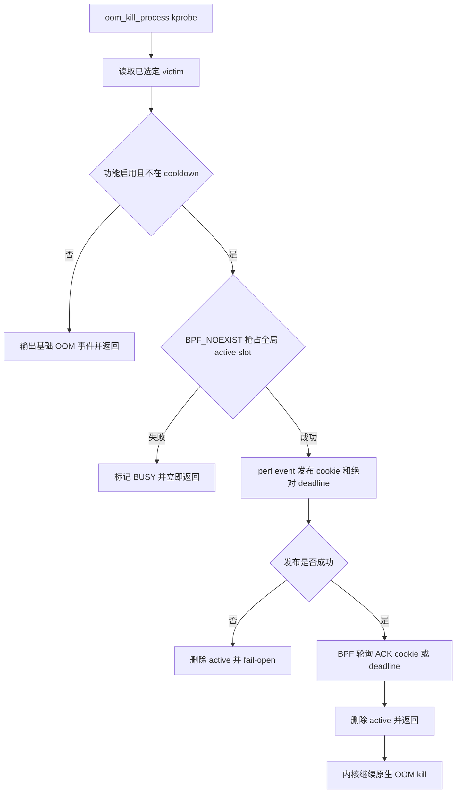
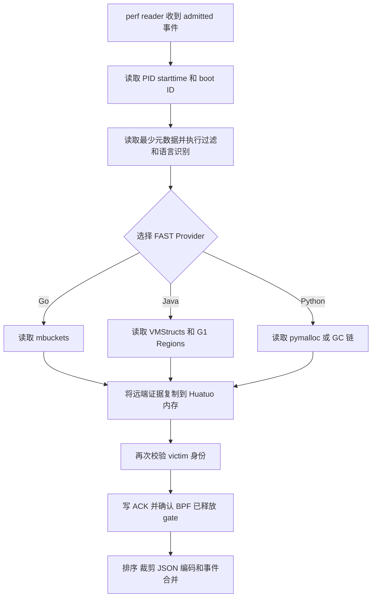

# OOM victim 多语言 Runtime FAST 内存切片

## 目标与边界

本功能在 Linux 已经选出 OOM victim、但尚未继续执行 kill 的短窗口内，读取该进程的
Runtime 托管堆信息，回答“哪些分配栈、对象类型或业务字段占用了最多内存”。首期支持
Go、HotSpot G1 Java 和 CPython。

当前实现只修改 Huatuo，不修改内核，不安装内核模块，也不在业务进程中预埋 agent。
功能默认关闭；启用后，常态阶段不扫描进程、不读取堆、不建立连接、不写快照文件。只有
真实 OOM 选出 victim 后才执行一次按需采集。

该结果是定位 Runtime 托管堆 OOM 的诊断切片，不是完整 core dump：

- 不统计 RSS、VMA、page、slab、页缓存和 native allocator；
- 不保证原子一致性，目标进程可能与外部读取并发执行；
- Java/Python 在大堆或多对象场景使用有界分层采样和估算；
- 任何采集失败、用户态退出或超时都必须 fail-open，不能阻止原生 OOM kill。

## 同步 kill gate



同步链路分为四步：

1. `oom_kill_process` kprobe 从 `oom_control.chosen` 读取真实 victim；
2. `bpf_perf_event_output` 把 victim、cookie 和绝对 deadline 写入 perf event array，
   Huatuo 的阻塞式 perf reader 被内核唤醒；
3. 用户态只对 admitted 请求读取 victim，完成远端内存复制后写 ACK map；
4. BPF 看到匹配 cookie 的 ACK 后立即释放 gate；没有 ACK 时到绝对 deadline 自动释放。

`oom_snapshot_active[0]` 使用 `BPF_NOEXIST`，整台宿主机最多一个 active 请求。并发 OOM
不排队，直接标记 `SKIPPED_BUSY`；冷静期内直接标记 `SKIPPED_COOLDOWN`。两条跳过路径
都不读取 `/proc`、不启动 Provider，也不延迟各自的 OOM kill。

`cookie` 与下一次事务隔离，迟到 ACK 不能释放新的 gate。perf event 投递失败、固定轮询
工作量耗尽、Huatuo 崩溃或 50 ms 到期时，BPF 都会删除 active slot 并 fail-open。
释放原因按 cookie 写入有界 LRU map，用户态校验并消费自己的记录；后一次 OOM 不会覆盖
前一次尚未校验的 ACK/deadline 结果。

当前硬上限是 **50 ms**，配置只接受 1 到 50 ms。这个值从 BPF 发布请求时开始计时，
不是每个 Provider 各有 50 ms；语言识别、远端读取、结果复制和 ACK 共用同一个 deadline。
ACK 提前到达时立即放行，不继续等待满 50 ms。

普通 kprobe BPF 不能 sleep 或主动调度，因此 admitted 请求等待 ACK 的时间内会忙轮询，
瞬时占用一个 CPU。50 ms 是故障兜底上限，不是采集目标时长；生产启用前仍需验证目标
内核上的调度与 softirq 尾延迟，并保证 Huatuo 有不属于 victim memcg 的可调度 CPU。

## 用户态关键路径



perf reader 在容器查询、cgroup enrichment 和存储之前提交采集，慢速 OOM 元数据不会消耗
采集窗口。身份使用 PID、`/proc/<pid>/stat` starttime 和 boot ID 防止 PID 复用；在远端
数据复制完成后再次校验身份。

ACK 前只保留必须依赖存活 victim 的工作。统一排序、输出大小裁剪、JSON 编码、OOM 事件
合并和存储均使用 Huatuo 已拥有的内存，在 ACK 后完成。`gate_release=ack` 表示 BPF 已观察
到 ACK 并删除 active；`gate_release=timeout_or_ack_missed` 表示采集得到的前缀仍可用，但
gate 已按 deadline 或异常路径释放。ACK 失败不会再丢弃已复制的部分结果。

## 各语言 Provider

### Go：读取 Runtime 已有的 mbuckets

Huatuo 从目标 ELF、映射和 Runtime 指令定位 `runtime.mbuckets` 与
`runtime.MemProfileRate`。第一阶段只遍历 bucket 头和计数，维护 in-use bytes Top-K；
第二阶段只复制候选 PC 栈并使用目标 ELF 的 `gopclntab` 符号化。

输出为 `allocation_site`，包含：

- `inuse_bytes`、`inuse_objects`；
- 原始 `sampled_bytes`、`sampled_count`；
- `allocation_stack`。

扫描为栈复制预留 5 ms，为结果构建预留 2 ms。结果按目标进程当时的
`MemProfileRate` 外推；如果应用将其设为 0，历史分配采样不存在，Provider 返回不可用。
该路径不输出对象类型、retained size 或引用链。

### Java：G1 Region 分层采样估算

Java 路径不使用 Attach、`jcmd`、`javaagent` 或 JVM 启动参数。OOM 后从目标
`libjvm.so` 读取 `gHotSpotVMStructs`、VMTypes 和常量表，动态解析当前 HotSpot 布局，
再通过 `process_vm_readv` 读取 G1 Region 的有效对象区间。

当前验证范围为 Linux x86-64 HotSpot G1 JDK 8、11、17、21、25，并覆盖 1 MiB/16 MiB
Region 以及压缩 oop/klass 的组合。Parallel GC、Serial GC、OpenJ9、GraalVM 等未支持
Runtime 必须快速返回 `PROVIDER_UNAVAILABLE`，不能按相似布局猜测。

50 ms 短窗口下的采样机制：

1. 按 Region 类型（Young、Old、Other）和占用率区间（0-25%、25-50%、50-75%、
   75-100%）分层；布局标签不可用时按占用率 fallback 分层；
2. Humongous 对象优先读取且按完整对象单元统计，只读取必要头部，避免复制大数组内容；
3. 普通分层先保证最多两个 Region 的基础样本，再按分层轮转继续增加覆盖；
4. 短窗口按 Region 分布读取小前缀，而不是从堆头连续扫描。常规目标为已用堆的 1%，
   受 4-12 MiB 约束；短窗口进一步使用 6-8 MiB 级有界分布窗口；
5. 对每个分层按“样本 class bytes / 样本已用 bytes”比例外推到该层总已用 bytes，
   汇总为 class 的 `inuse_bytes` 和 `inuse_objects`；
6. 输出原始 `sampled_bytes`、`sampled_count`、`raw_coverage`、分层完成数、RSE 和近似
   95% 区间，明确标记 `estimated=true`，不把外推结果伪装成完整扫描。

热循环限制最多解析 100 万对象；每 64 个对象检查 deadline。直接数组字段引用采样预留
约 2 ms；分层外推、字段整理、排序和统一输出裁剪均在 ACK 后使用本地数据完成，不占用
gate 窗口。业务类型每类只保留有界对象样本，用于解析一层数组字段的引用次数、浅大小和
长度分桶。它不计算 retained size、GC Root 或分配栈。

### Python：pymalloc 分层采样与 GC 有界回退

50 ms gate 下，CPython 3.8-3.14 只使用只读外部解析。Huatuo 从 executable/libpython
定位 `_PyRuntime`、interpreter、pymalloc arena/pool 和 GC generation 布局，通过
`process_vm_readv` 读取目标内存。CPython 3.13/3.14 使用 Runtime 自带的 `xdebugpy`
debug offsets 发现结构。

pymalloc 主路径：

1. 短窗口最多均匀选取 32 个 arena、读取 2048 个 pool header；
2. 按 block size、pool 占用率建立估算分层，并用 16 个地址区间保证空间覆盖；
3. 每层按占用 block 比例分配样本，最多读取 75000 个 block、12 MiB pool 数据；
4. pool 以约 128 KiB 的 `process_vm_readv` 批次流式读取，不保留完整堆副本；
5. 同类型 pool 先用分散探针确认，同质时直接批量计数；混合 pool 才逐对象或有界抽样；
6. 按同一 size/occupancy 分层的已完成 block 比例外推对象类型，输出原始样本、覆盖率和
   `estimated` 标记。

pool 批量读取失败时会退化为逐 pool 读取，跳过不可读 pool 并保留其余已完成样本；估算、
对象校验和排序在 ACK 后完成。

如果 pymalloc 元数据不适用，则回退到 GC generation 链。短窗口最多读取约 6000 个
GC tracked 对象，并先对每代做 head/tail 分布采样，避免第一代耗尽预算。该路径可输出
模块限定类型、浅大小，以及标准 dict/managed values 中的一层字段引用；不覆盖独立的
非 GC 对象、native extension 私有分配、retained size、分配栈和保留路径。

## 统一输出

结果直接附加在原始 OOM JSON 的
`tracer_data.runtime_memory_snapshot`，不创建独立快照目录。例如：

```json
{
  "schema_version": 2,
  "runtime_version": "21.0.8",
  "status": "PARTIAL_DEADLINE",
  "gate_release": "ack",
  "truncated": true,
  "truncation_reasons": ["deadline reached during external HotSpot heap scan"],
  "capture_duration_ms": 31,
  "coverage": {
    "consistency": "best_effort_external_hotspot_heap_scan",
    "size_semantics": "shallow_bytes",
    "scanned_bytes": 8388608,
    "heap_used_bytes": 10737418240,
    "raw_coverage": 0.00078125,
    "estimated": true,
    "estimation_method": "g1_region_prefix_stratified_v2",
    "known_gaps": ["retained size and native memory are unavailable"]
  },
  "payload_bytes": 16384,
  "entry_count": 1,
  "entries": [{
    "kind": "object_type",
    "name": "com.example.CacheEntry",
    "inuse_bytes": 67108864,
    "inuse_objects": 8192,
    "sampled_bytes": 524288,
    "sampled_count": 64,
    "estimated": true,
    "estimate_rse": 0.12,
    "estimate_confidence": "approx_95_percent"
  }]
}
```

三种语言统一使用 `entries`：Go 为 `kind=allocation_site`，Java/Python 为
`kind=object_type`。`COMPLETE` 只表示 Provider 在自身有界计划内完成；`PARTIAL_*` 表示
已保留可信前缀并说明截断原因。`raw_coverage` 是实际读取覆盖率，不能按它直接理解为
估算准确率；估算质量还取决于样本是否覆盖各分层以及对象在层内是否均匀。

默认 `MaxOutputBytes=1048576`。ACK 后统一按诊断价值排序，并保留能装入限制的最大
结构化前缀。常见状态包括 `COMPLETE`、`PARTIAL_DEADLINE`、
`PARTIAL_OBJECT_LIMIT`、`PARTIAL_RECORD_LIMIT`、`PARTIAL_OUTPUT_LIMIT`、
`PROVIDER_UNAVAILABLE`、`SKIPPED_BUSY`、`SKIPPED_COOLDOWN` 和 `GATE_TIMEOUT`。

## 配置

```toml
[EventTracing.OOMRuntimeSnapshot]
Enabled = false
GateTimeoutMilliseconds = 50
CaptureCooldownMilliseconds = 30000
FailureCooldownMilliseconds = 60000
MaxFailureCooldownMilliseconds = 300000
MaxConcurrentGates = 1
MaxOutputBytes = 1048576
MaxObjects = 100000
MaxStacks = 4096
MaxStackDepth = 64
```

`GateTimeoutMilliseconds` 只允许 1-50。动态配置从下一次 OOM 生效，例如改为 40 ms：

```bash
curl -X PUT http://127.0.0.1:19704/config \
  -H 'Content-Type: application/json' \
  -d '{"config":{"EventTracing.OOMRuntimeSnapshot.GateTimeoutMilliseconds":40}}'
```

`MaxConcurrentGates` 固定为 1。成功、部分结果或过滤命中后默认冷静 30 秒；身份不可用、
Provider 不可用、进程退出、采集失败或 timeout 从 60 秒开始按 60/120/240 秒指数退避，
上限 300 秒。成功会清零失败次数。

## 开销与上线边界

| 场景 | CPU | 工作内存 | 存储 |
|---|---|---|---|
| 常态且无 OOM | 无堆扫描；仅保留探针和原子指标 | 固定小型 BPF map 与控制结构 | 无快照写入 |
| 首个 admitted OOM | BPF 最多忙轮询 50 ms；Provider 在其他 CPU 按需读取 | Provider 有界缓冲，事件结束后可回收 | 合并进一条 OOM JSON |
| 并发或 cooldown OOM | 一次 map 判断后立即返回 | 不启动 Provider | 仅基础 OOM 事件 |

当前代码已具备 50 ms 配置硬限制、绝对 deadline、ACK 提前释放、perf 投递失败
fail-open、部分结果保留、版本矩阵和混合偏置用例。生产启用前仍必须在目标内核与实际
cpuset 上完成以下验收：

- ACK、deadline、tail-call 工作量耗尽、perf 投递失败和 Huatuo 异常的故障注入；
- OOM 风暴、多 memcg、victim 提前退出、PID 复用、迟到 ACK 和 Huatuo 重启；
- BPF 忙轮询对调度、softirq 和业务尾延迟的影响；
- Java/Python 极端混合负载下 Top-K 召回率不低于 90%，主要类型估算误差不高于 20%；
- 目标生产内核的 BPF verifier 加载、真实 memcg OOM 和灰度关闭开关。

因此功能应保持默认关闭，完成目标环境故障注入与压力验收后再灰度启用。诊断失败只能
降低切片质量，不能改变 victim，也不能取消或无限延长 OOM kill。
